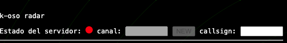

# k-oso radar for Star Citizen

## Overview

[k-oso radar](https://github.com/faiadolabs/k-oso-radar) is a utility specifically designed for Star Citizen with the purpose of locating positions on planetary surfaces.

The idea is to place points of interest around a central reference point using a distance and heading vector relative to that center.

It is currently in the concept phase. You can access its [demo](https://faiadolabs.github.io/k-oso-radar/).

This subcomponent using WebSockets allows synchronizing point recognition between multiple users.

## Contributing

Contributions are welcome! Please feel free to submit a Pull Request.
